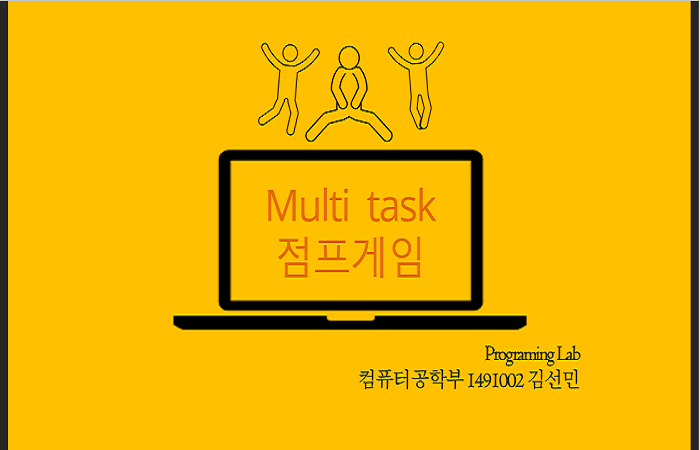
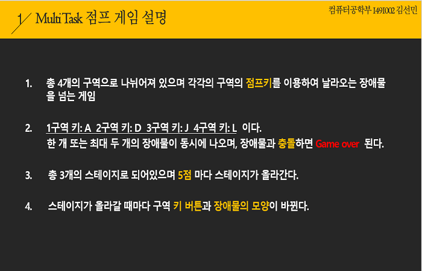
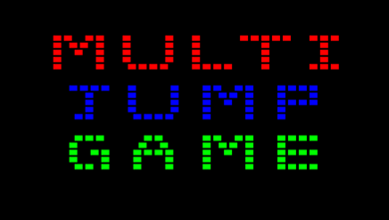
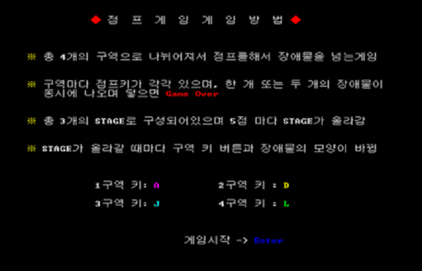
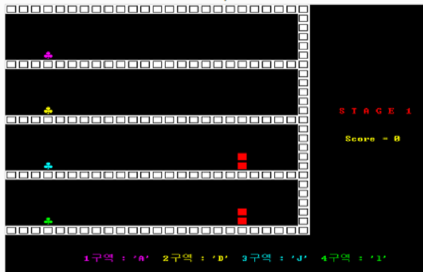
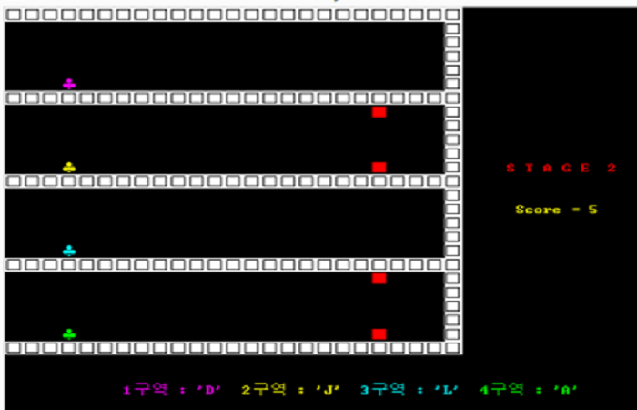
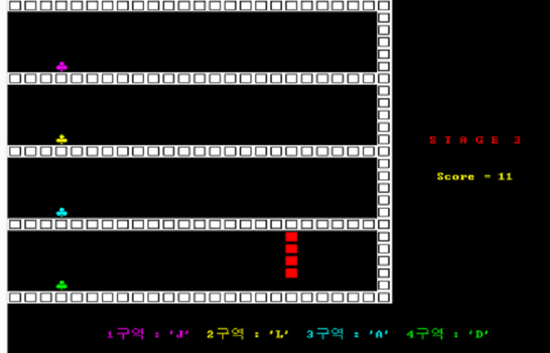
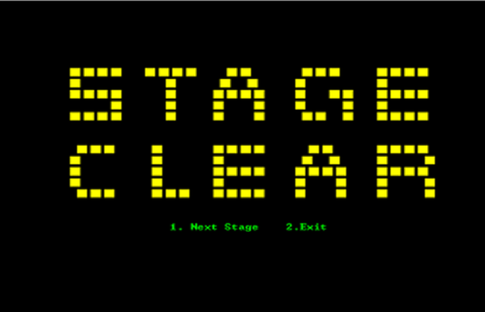
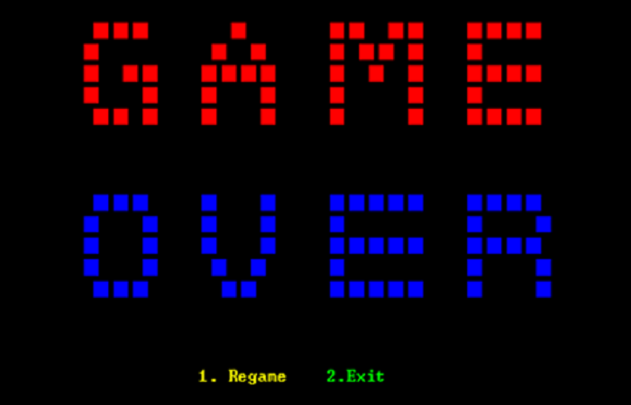

# Multi JumpGame

### C언어를 이용한 멀티점프게임

## 프로그램 실행화면

### (0). 멀티점프게임

### (1). 게임소개
- 총 4개의 구역이 있으면 각각의 구역의 점프키를 이용하여 날라오는 장애물을 넘는 게임
- 1구역 키 : A / 2구역 키 : D / 3구역 키 : J / 4구역 키 : L 이며 최소 한개 또는 최대 두 개의 장애물이 동시에 나오며, 장애물과 충돌시 Game Over 됨
- 총 3개의 스테이지로 되어있으면 5점 마다 스테이지가 올라간다
- 스테이지가 올라갈 때마다 구역 키 버튼과 장애물의 모양이 바뀜   

### (3). 시작화면

### (4). 게임방법화면

### (5). 게임동작화면   
### 스테이지1

### 스테이지2

### 스테이지3

### (6). 게임클리어화면

### (7). 게임종료

